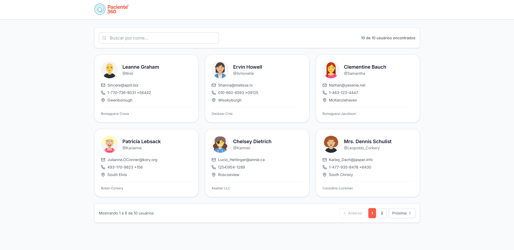
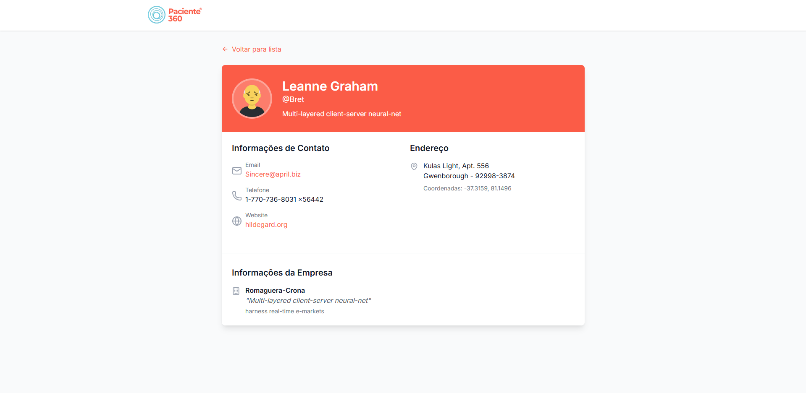

# User List Frontend

Uma aplicação web para listagem de usuários desenvolvida como parte do desafio técnico. A aplicação consome a API pública JSONPlaceholder para exibir uma lista paginada de usuários com funcionalidades de busca e visualização de detalhes.


## 🌟 Demo

Projeto disponível em [https://userlistfrontend.vercel.app/](https://userlistfrontend.vercel.app/)


## 🚀 Funcionalidades

### ✅ Requisitos Obrigatórios Implementados

- **Listagem de usuários paginada** (6 usuários por página)
- **Exibição de nome, e-mail e avatar** para cada usuário
- **Loading state** durante o carregamento dos dados
- **Tela de detalhes** do usuário em rota separada
- **Botão de retorno** da tela de detalhes para a listagem
- **Filtro de busca por nome** (busca local por nome, email e username)
- **Responsividade** para mobile e desktop
- **Código limpo e bem estruturado** com separação de responsabilidades

### 🎯 Diferenciais Implementados

- **Deploy** do projeto na Vercel
- **Documentação completa** com instruções de uso

## 🛠️ Tecnologias Utilizadas

- **React 19** com **TypeScript** 
- **React Router DOM** para navegação entre páginas
- **Tailwind CSS** para estilização
- **Lucide React** para ícones
- **JSONPlaceholder API** como fonte de dados
- **DiceBear Avataaars API** para gerar avatares

## 📦 Instalação e Execução

### Pré-requisitos

- Node.js 18+ 
- npm, yarn ou pnpm

### Passos para executar localmente

#### Da forma mais prática

1. **Clone o repositório**
```bash
  git clone https://github.com/jonathanoliveirarocha/user-list-frontend
```
2. **Execute o arquivo start.bat**

3. **Acesse a aplicação**
   
   Abra [http://localhost:5174](http://localhost:5174) no seu navegador

#### ou

#### Pelo terminal
1. **Clone o repositório**
```bash
  git clone https://github.com/jonathanoliveirarocha/user-list-frontend
```
2. **Navegue até a pasta do projeto**
```bash
  cd user-list-frontend
```

3. **Instale as dependências**
```bash
  npm install
```

4. **Acesse a aplicação**
   
   Abra [http://localhost:5174](http://localhost:5174) no seu navegador


## 🏗️ Estrutura do Projeto

```bash
📁 src                          # Diretório principal da aplicação
├── 📁 api                     # Contém serviços e chamadas à API externa
│   └── userApi.ts             # Funções para buscar dados dos usuários na API JSONPlaceholder
├── 📁 assets                  # Recursos estáticos como imagens e ícones
│   └── logo.png               # Logo da aplicação
├── 📁 components              # Componentes reutilizáveis da interface
│   ├── CardSkeleton.tsx       # Esqueleto de carregamento dos cards de usuários
│   ├── ErrorMessage.tsx       # Componente para exibir mensagens de erro
│   ├── Header.tsx             # Cabeçalho fixo da aplicação
│   ├── Pagination.tsx         # Componente de paginação customizado
│   ├── SearchBar.tsx          # Barra de pesquisa com contador de resultados
│   ├── UserCard.tsx           # Card de exibição dos dados resumidos do usuário
│   ├── UserDetailsSkeleton.tsx # Esqueleto da tela de detalhes do usuário
│   ├── UserList.tsx           # Lista de usuários com paginação e busca
├── 📁 contexts                # Contextos globais compartilhados via React Context API
│   └── UserContext.tsx        # Gerencia paginação, filtro e quantidade de usuários
├── 📁 hooks                   # Hooks personalizados
│   └── useUsers.ts            # Hook que busca usuários da API e controla estado de loading/erro
├── 📁 pages                   # Páginas principais da aplicação
│   ├── Home.tsx               # Página inicial com lista de usuários
│   └── UserDetails.tsx        # Página de detalhes de um usuário específico
├── 📁 routes                  # Configurações de rotas da aplicação
│   └── AppRoutes.tsx          # Define as rotas disponíveis usando React Router
├── 📁 types                   # Tipagens TypeScript compartilhadas
│   └── user.ts                # Tipagem da estrutura dos dados de usuário
├── App.tsx                    # Componente raiz que monta a aplicação
├── index.css                  # Estilos globais da aplicação (com Tailwind)
├── main.tsx                   # Ponto de entrada da aplicação React

```

## 🎨 Design e UX

### Responsividade
- **Mobile First**: Design otimizado para dispositivos móveis
- **Grid Responsivo**: Layout que se adapta ao tamanho da tela

### UX Features
- **Imagens e Cores**: da Paciente 360, para um design bonito e moderno 
- **Loading States**: Feedback visual durante carregamento
- **Error Handling**: Tratamento elegante de erros
- **Empty States**: Mensagens informativas quando não há dados
- **Hover Effects**: Feedback visual em interações
- **Smooth Transitions**: Transições suaves entre estados

## 📱 Funcionalidades Detalhadas

### Listagem de Usuários
- Exibe 6 usuários por página
- Cards com informações essenciais (nome, email, telefone, cidade, empresa)
- Avatars gerados dinamicamente
- Hover effects para melhor UX

### Busca e Filtros
- Busca em tempo real por nome, email ou username
- Contador de resultados
- Reset automático da paginação ao filtrar

### Paginação
- Navegação entre páginas
- Indicador de página atual
- Informações sobre total de registros
- Botões de navegação (anterior/próxima)

### Detalhes do Usuário
- Informações completas do usuário
- Layout organizado em seções
- Links clicáveis (email, telefone, website)
- Botão de retorno para listagem

## ⏱️ Tempo de Desenvolvimento

**Tempo total investido**: Aproximadamente 2.5 horas

## 🤔 Decisões Técnicas

### Tailwind CSS
Escolhi Tailwind pela rapidez de desenvolvimento e consistência visual, além de ser amplamente adotado no mercado.

### DiceBear Avataaars API
DiceBear Avatars API entrou no projeto porque é simples, grátis e gera avatares únicos só com base no ID. Evita ter que baixar ou armazenar imagens e ainda dá um toque visual legal pros cards.

### JSONPlaceholder API
 Foi a escolhida pra simular os dados porque é fácil de usar, tem uma estrutura completa (usuários, posts, etc.) e já vem pronta pra testar requisições sem precisar montar um backend do zero. Outras opções até existem, mas ou pedem configuração demais, ou têm limite de uso, ou são mais complexas do que o necessário pra esse projeto.

## 📷 SAMPLE

| Lista de Usuários | Descrição de Usuário |
|-------|--------|
|  |  |
